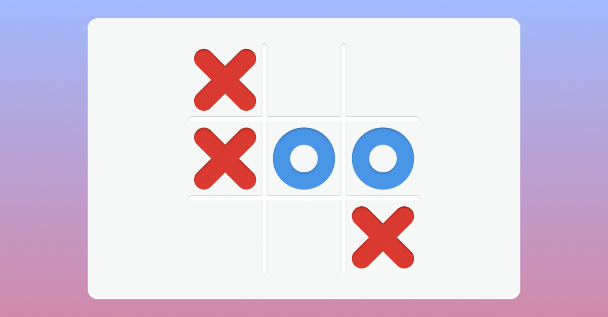

# TOP Javascript Course Project - Tic Tac Toe

[Play Tic Tac Toe Game](https://emhng.github.io/odin-tictactoe/)

## Playing locally

If you'd like to play locally:

1. Download the repo by cliicking on Code -> Download Zip
2. Unzip the downloaded repo and open the folder
3. Click on index.html

## Project Objectives

Using IFFE and factory functions, create a game of tic tac toe.

- Allow players to input their names
- Add a start/reset button
- Congratulate the winning player

## Learnings

Really happy with the new course order for TOP.

I used a lot of the new things I learned from the intermediate HTML/CSS course in this project, such as CSS grid.

This was the first project where I decided to use all arrow functions.

It took me a bit to wrap my head around how to use factory functions and IFFE for this project but after completing the project I have a better understanding on when to use them and why they are useful.
